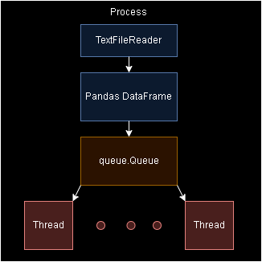

# Documentação
## Descrição
Este projeto tem como objetivo criar um Banco de Dados com todas as informações disponíveis de CNPJs disponibilizados pela Receita Federal em https://dadosabertos.rfb.gov.br/CNPJ/ e serviu também para meus estudos de Concorrência e Paralelismo (programação Assíncrona). Foram utilizadas três formas diferentes de programação Assíncrona: I/O, Processos e Threads.

Como todo projeto sempre possuirá melhorias, este não é diferente. Aceito quaisquer sugestões, correções, conselhos e comentários 😁.

## Ferramentas
* Sistema operacional: Windows 11;
* Liguagens de programação: Python-3.11.5 e SQL;
* Módulos de Python: [requeriments.txt](requirements.txt);
* Banco de Dados: PostgreSQL;
* Ferramenta para acesso ao Banco de Dados: pgAdmin 4.

## Visão geral do algoritmo do projeto
### Download dos arquivos
Download é realizado utilizando lógica Asynchronous I/O através das bibliotecas [aiohttp](https://docs.aiohttp.org/en/stable/) e [asyncio](https://docs.python.org/3/library/asyncio.html). Através de Web Scraping (usando [selenium](https://selenium-python.readthedocs.io/)) são coletados os nomes dos arquivos no site, em seguida, de forma paralela, é iniciado o download dos Bytes iterando chunks do conteúdo do download (Stream), em seguida os Bytes são descompactados e é salvo o arquivo `.csv` resultante.

O script [download_unzip.py](download_unzip.py) é o responsável por fazer o download de todos os arquivos `.csv` necessários.

### Transformação e Carregamento dos arquivos
Para a leitura e transformação dos arquivos foi utlizado o [pandas](https://pandas.pydata.org/docs/) e para conexão com o Banco de Dados e inserção dos dados foi utilizado o [SQLAlchemy](https://docs.sqlalchemy.org/en/20/).

#### Arquivos menores
Os arquivos menores são as tabelas das chaves estrangeiras (Foreign Keys) dos arquivos maiores, por serem pequenas quantidades de dados e tabelas de rápida criação e inserção, foi totalmente feito de forma síncrona levando poucos segundos para ser executado.

O script [transform_and_load_small_tables.py](transform_and_load_small_tables.py) cria as tabelas e faz a povoação delas (inserção dos dados).

#### Arquivos maiores
As tabelas maiores são transformadas e inseridas através da Stream dos arquivos com a seguinte estrutura em cada processo criado:

Cada processo irá ler em `Stream` seu arquivo individual, cada chunk de arquivo lido será processado com o `Pandas` e inserido numa `Queue` que é compartilhada entre todas as `Threads` naquele processo. Cada Thread irá estabelecer uma conexão com o banco de dados e iterar na Queue inserindo os dados.

O processo de transformar e inserir dados se repete para cada chunk de dados.

Os processos criados possuem essa estrutura na imagem acima, sendo cada um lendo de um arquivo diferente, ou seja, não há compartilhamento de dados entre processos, mas há compartilhamento entre Threads no mesmo processo através da Queue.

O script [transform_and_load_big_tables.py](transform_and_load_big_tables.py) é responsável pela criação e povoação das tabelas maiores.

### OOP
A Programação Orientada a Objeto encontra-se na pasta [models](models) e é utilizada na Transformação e Inserção das tabelas maiores (na das menores é utilizada apenas para pegar o `engine`).

As duas principais classes são [BaseModel.py](models\BaseModel.py) e [MyThread.py](models\MyThread.py).

* [BaseModel.py](models\BaseModel.py) declara todas as variáveis e métodos necessários para as classes de cada tabela maior, onde a única diferença entre as classes das tabelas são o `schema`, `table_name`, `fk` (Foreign Keys) e o método `process_chunk`.
* [MyThread.py](models\MyThread.py) herda da classe `threading.Thread` reescrevendo o método `run()` para pegar dados da `Queue` e inserir no Banco de Dados.

## Configuração do Ambiente
### Banco de Dados
Criar o Banco de Dados manualmente e localmente utilizando o pgAdmin 4 com as configurações padrão.

### Python
Instalar versão 3.11 ou mais recente de Python, em seguida criar um ambiente virtual executando o comando `python -m venv <nome da pasta>` no terminal (estando dentro da pasta do seu projeto) e ativar o abiente virtual com o comando `<nome da pasta>\Scripts\activate`.

Criar um arquivo `.env` para definir as variáveis de ambiente de acordo com o exemplo [.env_example](.env_example).

    Atenção ⚠: Nas variáveis de ambiente THREADS_NUMBER e CHUNKSIZE a quantidade informada será para cada processo definido, e.g.: com THREADS_NUMBER="8" você terá 8 Threads rodando em cada processo, com CHUNKSIZE="100000" serão chunks de dados de tamanho 100000 sendo processados e inseridos no Bando de Dados para cada processo.

Finalmente executar o script [setup.py](setup.py) que irá instalar todas as dependências (módulos) de Python e definir as variáveis de ambiente infromadas no arquivo `.env`.

## Ordem de execução dos scripts
1. [setup.py](setup.py) -> Configuração do ambiente (Síncrono);
2. [download_unzip.py](download_unzip.py) -> Download dos arquivos (Assíncrono);
3. [transform_and_load_small_tables.py](transform_and_load_small_tables.py) -> Criação e povoação de tabelas menores (Síncrono);
4. [transform_and_load_big_tables.py](transform_and_load_big_tables.py) -> Criação e povoação de tabelas maiores (Assíncrono).

## Possíveis melhorias
* SQLAlchemy: Não fui muito a fundo na `engine` e conexões do SQLAlchemy, talvez tenha uma melhor performance caso seja utilizada [`Session()`](https://docs.sqlalchemy.org/en/20/orm/session.html) e até mesmo uso de [`SQLALchemy.orm`](https://docs.sqlalchemy.org/en/20/orm/) e sua criação de modelos de tabelas. Outra ideia seria mexer nas configuração do `engine` de conexão;
* Testes: Este projeto não possui testes automatizados, pretendo criar em algum momento utilizando o [`pytest`](https://docs.pytest.org/en/7.1.x/contents.html);
* Compiladores: Para tentar aumentar a performance, pricipalmente de processamento dos dados, utilizar compiladores como PyPy e estratégias de Cython podem acrescentar um grande ganho. Ja estudei sobre porém nunca apliquei, seria um bom teste;
* Iserção dos dados: Como o processo de inserção em Banco de Dados Relacional não é algo exatamente rápido por causa da manutenção das propriedades ACID (atomicity, consistency, isolation, and durability), não sei dizer o que poderia ser feito para essa melhora (pricipalmente porque não pesquisei sobre o assunto). Aceito sugestões 🙃;
* Tabelas: criar chaves primárias para as tabelas maiores;
* Stop point: métodos de rastrear até onde foram inseridos os dados de arquivos maiores e retomar a inserção a partir desse ponto.
